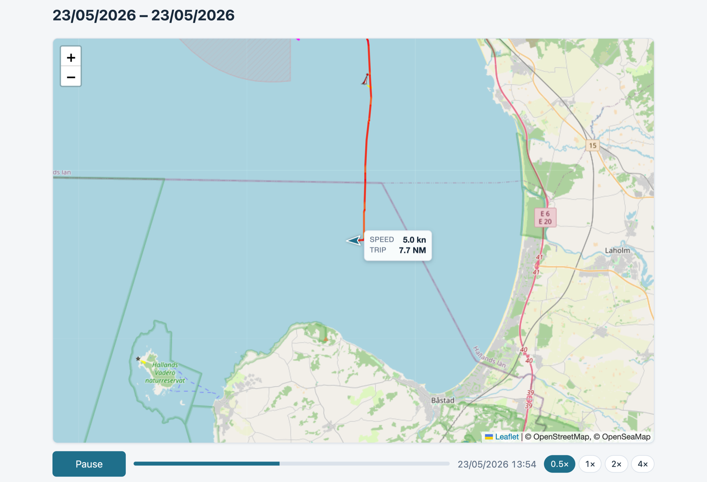
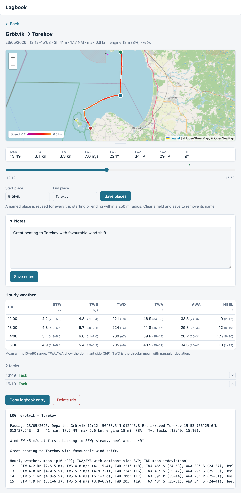

# Sailing Logbook

Just another Automatic Logbook for [Signal K](https://signalk.org/), this one is
focused on sailing performance.

It detects trips from boat speed, marks tacks and gybes, and reports hourly wind
and heel statistics computed on demand from the onboard InfluxDB. A built-in web
app lists your trips and produces a ready-to-paste logbook entry for each one.

Its standout is the map. Every trip is drawn on a speed-coloured chart, and a
whole passage — a weekend, a two-week cruise — **plays back as an animation**:
the boat sails its own track, pausing in each port along the way. That playback
**can be saved straight to an MP4**, rendered frame by frame **entirely in your
browser** — any browser with the **WebCodecs API**, even Safari on an iPhone —
**with no server-side processing at all.**





## Features

- **Passage playback**: pick two dates and replay everything between them as an
  animation. The boat follows its recorded track drawing a speed-coloured trail,
  the view follows and reframes for each leg while resting in port (longer
  overnight), leaving a named marker at the departure and every port reached. A
  readout beside the boat shows speed, an engine badge under power, and a trip
  meter over the whole selected range. An hour under way plays in two seconds,
  adjustable 0.5×–4×.
- **Save a passage as video** — the killer feature. The playback renders to an
  MP4 frame by frame, **entirely in the browser using WebCodecs, even on an
  iPhone, with no server-side processing**: nothing is uploaded, nothing is
  rendered on the Signal K server. Each frame waits for its chart tiles, so the
  film is identical however slow the connection is — a real render, not a screen
  recording. Portrait, square or landscape; on a phone the share sheet offers the
  camera roll, elsewhere it downloads. Needs a browser with WebCodecs (Chrome,
  Edge, or Safari 17+).
- **Track map** for each trip: the route drawn from the InfluxDB position
  history, coloured by boat speed, with tacks/gybes and the start/end marked, on
  an OpenStreetMap base with the OpenSeaMap seamark overlay. A timeline slider
  under the map scrubs through the trip, moving a highlight dot along the track
  and updating a fixed info panel with that moment's conditions (SOG/STW,
  TWS/TWD, TWA/AWA, heel, plus an engine badge for the stretches under power);
  clicking the track or a maneuver jumps the scrubber there. Under the slider a
  rolling half-hour graph shows STW, TWS and TWD the way a plotter draws them
  under way: the marker's moment at the top, the half hour behind it running
  down. Zoom in on a stretch and the map follows the slider, keeping the boat
  centred; at the zoom the whole track is framed at, it stays put. Drag the handle below the map to enlarge it
  for a closer look. The map tiles need the network; offline, the speed-coloured
  track still shows on a blank canvas.
- **Automatic trip detection** from `navigation.speedOverGround` with configurable
  speed thresholds and minimum durations (hysteresis, so brief speed spikes don't
  start a trip and a plugin restart doesn't end one), backed up by the position
  trail: a boat that hasn't left a 50 m circle in the whole stop window has
  finished her trip whatever the speed says, and a boat that hasn't actually gone
  anywhere hasn't started one. Both matter at a mooring, where GPS noise alone
  keeps the reported speed astride the thresholds. Either rule abstains unless the
  fixes cover the window, so lost position data changes nothing.
- **Tack / gybe detection** from `environment.wind.angleTrueWater` (falling back
  to `environment.wind.angleApparent` for a retrospective scan when the
  true-wind derivation logged nothing for that stretch), robust to real-world
  noise:
  - counts a maneuver only if the new tack is held long enough, and — for a tack —
    if the boat actually bore away onto it, rather than crossing the wind and
    lying there while the sails come down,
  - a dead-run deadband ignores the wind-angle flutter near a dead run,
  - flip-flop tolerance survives a drawn-out maneuver that wanders across the
    wind before settling,
  - a boat-speed gate and a proximity gate (time and distance to the trip
    start/end) drop harbour and mooring turns made under engine,
  - classified by how the boat crossed the wind: over the stern → gybe, over the
    bow → tack.
- **Hourly statistics** from InfluxDB over each trip's exact time window, derived
  on demand and cached per completed trip: TWS (m/s), STW (kn), TWD (circular mean ± angular
  deviation), TWA, AWA and heel (degrees), each as mean with a p10–p90 range
  (the "significant" min/max, with raw extremes filtered out). TWA/AWA also show
  the dominant tack side.
- **Each hour opens into a graph of itself**, in the manner of a chartplotter's
  wind history: time runs down the box, with a narrow panel each for STW, TWS and
  TWD drawn from the logged history rather than the hour's means, lightly
  smoothed. Every panel is scaled to its own range for that hour, and the box
  always spans the full hour, so the minute scale reads the same on every row.
- **Motoring vs sailing**: reads `propulsion.<n>.state` to drop maneuvers made
  under engine and to flag motoring trips (their report omits tacks/gybes and the
  point-of-sail wording). The engine state comes from a separate provider — this
  plugin does no engine detection of its own (see Requirements).
- **Place names** via OpenStreetMap Nominatim (best-effort, always editable).
- **Trip notes**: a free-text field for your own remarks on a trip. They're saved
  with the trip and included in the copied logbook entry, above the hourly data.
- **Retrospective scan**: reconstruct past trips from InfluxDB history for any
  date range, using the exact same detection logic as live.
- **Web app** with a trip list, a detail view, editable place names, per-maneuver
  deletion, and a one-click plain-text logbook entry to copy.
- **Season view**: the trip list is filtered by year (defaulting to the most
  recent season with trips, linkable as `?year=`) and topped with that season's
  totals — trips, distance, time under way, tacks/gybes and time under engine.
- **Localizable** web app: English and Swedish are included, and adding a
  language is just a string set (`STR` in `public/app.js` for the UI and
  `plugin/lib/report.js` for the logbook entry, each with its `locale`). Follows
  the browser language, with a `?lang=` override.

## Requirements

- Signal K server with a running InfluxDB 1.x sink
  ([`signalk-to-influxdb`](https://www.npmjs.com/package/signalk-to-influxdb))
  logging at least: `navigation.speedOverGround`, `navigation.speedThroughWater`,
  `navigation.position`, `environment.wind.speedTrue`,
  `environment.wind.angleTrueWater`, `environment.wind.angleApparent`,
  `environment.wind.directionTrue`, `navigation.attitude.roll`.

  **Switch on that plugin's "Record Track"** — it is off by default, and without
  it no position reaches the database, so trips have no map and a retrospective
  scan cannot place them. Its "Latitude and Longitude as separate measurements"
  option is optional: the logbook reads the position either way.
- **Node.js ≥ 22.5** — storage uses the built-in `node:sqlite`, so there is no
  native module to compile.
- **A `propulsion.<n>.state` provider** (`started` / `stopped`) for the
  motoring/sailing distinction. The logbook reads this path from InfluxDB; it has
  no built-in engine detection. For example:
  - Native **NMEA 2000 engine data** (PGN 127489), if you have an engine gateway.
  - [`@meri-imperiumi/signalk-alternator-engine-on`](https://www.npmjs.com/package/@meri-imperiumi/signalk-alternator-engine-on)
    — infers it from alternator power, for a boat with no engine data on the bus.

  (There is also [`signalk-derived-engine-state`](https://github.com/johansolve/signalk-derived-engine-state),
  the author's own more elaborate take — alternator temperature, charge current
  and wind-vs-speed, with history backfill — but it was built around one specific
  boat, so treat it as a curiosity rather than a drop-in.)

  Without a provider the plugin still works; trips just aren't classified as
  motoring and harbour turns under engine may be counted as tack/gybe maneuvers.

## Install

From the Signal K app store, or manually as a file dependency:

```bash
cd ~/signalk-sailing-logbook && npm install
cd ~/.signalk && npm install ../signalk-sailing-logbook   # adds a file: dependency
```

Then enable **Sailing Logbook** in the Signal K plugin config and restart the
server. The SQLite file defaults to the plugin's own data directory; set `dbPath`
to point it elsewhere (ideally an SSD, if your data directory sits on an SD card).

## Configuration

| Option | Default | Meaning |
| --- | --- | --- |
| `dbPath` | (plugin data dir) | SQLite file location; blank uses the plugin's data directory |
| `startKnots` / `stopKnots` | 0.5 / 0.3 | SOG thresholds to start / stop a trip |
| `startMinSeconds` / `stopMinSeconds` | 180 / 600 | how long the condition must hold |
| `stopSpreadMeters` | 50 | also end a trip when every fix over the stop window stays within this many metres; 0 turns the position rules off |
| `minNewTackSeconds` | 90 | min time on the new tack for a maneuver to count |
| `runDeadbandDeg` | 10 | degrees past dead-downwind before a side counts |
| `newTackMinAwaDeg` | 20 | a maneuver must reach this *apparent* wind angle on the new side; set it below your close-hauled apparent angle. 0 switches it off |
| `minSailingSpeedKnots` | 2 | min boat speed (STW) for a maneuver to count |
| `maneuverEdgeMarginMinutes` | 5 | ignore maneuvers within N minutes of trip start/end |
| `maneuverEdgeRadiusMeters` | 200 | ignore maneuvers within N metres of the start/end |
| `engineAware` | true | use engine state to drop maneuvers under engine and flag motoring trips |
| `engineStatePath` | `propulsion.0.state` | path read from the engine-state provider (live and from InfluxDB) |
| `motorTripPercent` | 85 | flag a trip as motoring when at least this % of it ran under engine |
| `geocode` | true | look up place names via Nominatim |
| `placeRadiusMeters` | 250 | reuse a named place for trips starting/ending within this radius |
| `influxHost` / `influxPort` / `database` | localhost / 8086 / libelle | InfluxDB connection |
| `username` / `password` | — | InfluxDB auth (blank if disabled) |

## Web app

Served at `http://<server>:3000/signalk-sailing-logbook/` and from the Signal K
admin **Webapps** menu.

- Reading (trip list, detail, report, track map, passage playback and its video
  export) works for anonymous users when the server allows readonly access.
- Editing place names and notes, deleting trips/maneuvers, and running a history
  scan require an admin login.

## HTTP API

Read (honour readonly access), under `/signalk/v1/api/sailing-logbook`:

- `GET /trips` — list trips with tack/gybe counts
- `GET /trips/:id` — trip detail (trip row and maneuvers)
- `GET /trips/:id/hourly` — hourly wind and heel statistics (cached per completed trip)
- `GET /trips/:id/series?from=&to=&fields=&step=` — named channels (`sog`, `stw`,
  `tws`, `twd`, `twa`, `awa`, `heel`) over a window inside the trip, on one
  shared time grid; the history behind the per-hour graphs. The window is
  clamped to the trip and the grid to a point budget.
- `GET /trips/:id/track` — downsampled position+SOG track for the map
- `GET /trips/:id/report?lang=en|sv` — plain-text logbook entry

Admin only, under `/plugins/signalk-sailing-logbook`:

- `PUT /trips/:id/place` — set manual start/end place names
- `DELETE /trips/:id/place/:side` — clear the manual name for one side (`start`/`stop`)
- `PUT /trips/:id/notes` — set or clear the trip's free-text notes
- `DELETE /trips/:id` — delete a trip
- `DELETE /events/:id` — delete a single maneuver
- `POST /scan` — `{ from, to }` (ms epoch): retrospectively detect trips

## How it works

The plugin persists *events* (trip start/stop, tack/gybe markers with their
position) to SQLite; the raw sensor history stays in InfluxDB. Hourly statistics
are derived from InfluxDB on demand over the trip's `[start, stop]` window rather
than copied into the plugin. For a completed trip that window is in the past, so the
computed result is cached on the trip row and reused on every later load — never
recomputed, never stale. The queries are time-bounded, which also excludes the
occasional mis-timestamped GPS point some NMEA sources emit.

The detail view fetches the trip, the map track and the hourly statistics as
separate requests, so the page renders immediately from SQLite while the InfluxDB
work loads alongside rather than holding it up.

Live detection feeds the state machine one sample at a time using server receive
time; retrospective scanning replays the InfluxDB history through the exact same
state machine.

## License

MIT
